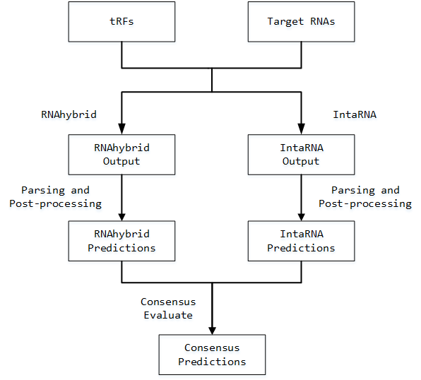
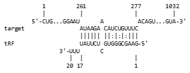
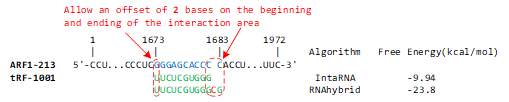
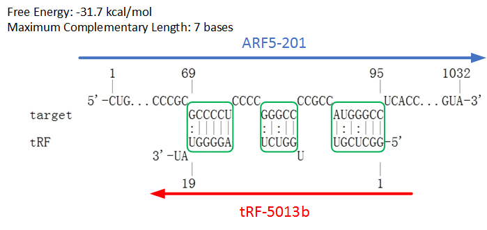
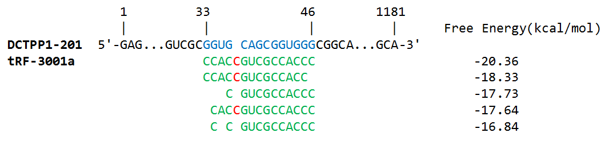

# tRFtarget-pipeline
[](https://github.com/ZWang-Lab/tRFtarget-pipeline) [](https://hub.docker.com/repository/docker/az7jh2/trftarget/general)



tRFtarget-pipeline is designed to find **RNA-RNA interaction sites** between transfer RNA-derived fragments (tRFs) and target RNAs. It utilizes [*RNAhybrid*](https://bibiserv.cebitec.uni-bielefeld.de/rnahybrid) and [*IntaRNA*](http://rna.informatik.uni-freiburg.de/IntaRNA/Input.jsp) to provide binding sites predicted via **two different mechanisms**, evaluate the **consensus** of these two predictions, and output fully-featured binding sites in a unified **structured** format together with **enhanced ASCII RNA-RNA interaction illustrations** (shown in the example below). It can also be used to find target genes for other small RNAs such as miRNAs.



All binding sites in **tRFtarget database** (http://trftarget.net/) are predicted using tRFtarget-pipeline v0.3.0.

## Table of Contents

1. [Installation](#1-installation)

2. [Usage](#2-usage)

   2.1 [Command](#21-command)

   2.2 [Input](#22-input)

   2.3 [Output](#23-output)

   2.4 [Binding sites in CSV files](#24-binding-sites-in-csv-files)

   2.5 [All Options](#25-all-options)

   2.6 [Elapsed time & Output file size (before version 0.3.0)](#26-elapsed-time--output-file-size-before-version-030)

3. [Method](#3-method)

   3.1 [Enclosed Package version (after version 0.3.0)](#31-enclosed-package-version-after-version-030)

   3.2 [Calling *RNAhybrid* & post-processing](#32-calling-rnahybrid--post-processing)

   3.3 [Calling *IntaRNA* & post-processing](#33-calling-intarna--post-processing)

   3.4 [Consensus evaluation](#34-consensus-evaluation)

   3.5 [Definition of Maximum Complementary Length (MCL)](#35-definition-of-maximum-complementary-length-mcl)

   3.6 [Definition of duplicated entries in *IntaRNA* output](#36-definition-of-duplicated-entries-in-intarna-output)

4. [Citation](#4-citation)

5. [Contact us](#5-contact-us)

## 1. Installation

We provide **online service** of tRFtarget-pipeline in [http://trftarget.net/online_targets](http://trftarget.net/online_targets).

For local usage, we provide **Docker** or **Singularity** images for immediate using.

```bash
# For Docker
docker pull az7jh2/trftarget:0.3.2
# For Singularity
singularity build trftarget-0.3.2.sif docker://az7jh2/trftarget:0.3.2
```

To test the installation (should print the version of tRFtarget-pipeline)

```bash
# For Docker
docker run -it --rm az7jh2/trftarget:0.3.2 tRFtarget -v
# For Singularity
singularity exec trftarget-0.3.2.sif tRFtarget -v
```

## 2. Usage

### 2.1 Command

The command to run tRFtarget-pipeline with default setting is:

```bash
# For Docker
docker run -it --rm -v <path>:/data az7jh2/trftarget:0.3.2 tRFtarget -q <query_fasta_file_name> -t <target_fasta_file_name> -n 1 --e_rnahybrid -15 --e_intarna 0 -b 1 -s 6
# For Singularity
singularity exec -B <path>:/data trftarget-0.3.2.sif tRFtarget -q <query_fasta_file_name> -t <target_fasta_file_name> -n 1 --e_rnahybrid -15 --e_intarna 0 -b 1 -s 6
```

`<path>` is the valid and **absolute** path of the folder in the host machine to be mounted in the Docker/Singularity image for data exchanging (`readlink -f` can be used to get the absolute path of folder).

 `<query_fasta_file_name>` and `<target_fasta_file_name>` are the file names (**without path**) of *FASTA* files of query small RNAs and target RNAs respectively. Both of them are required to be located in the `<path>` folder.

### 2.2 Input

* A *FASTA* file of query small RNAs. Compressed file (such as `.gz`) currently not supported.
* A *FASTA* file of target RNAs (Optional). Compressed file (such as `.gz`) currently not supported. If not provided, use 100,218 Protein-coding transcript sequences (GRCh38.p13) as target RNAs instead.

### 2.3 Output

The output of tRFtarget-pipeline are **6 CSV files** located in the `<path>` folder:

1. `trfs_info.csv` : show tRF ID, sequence and sequence length
2. `transcripts_info.csv` : show transcript ID, sequence and length
3. `rnahybrid_results.csv` : predicted RNA-RNA interactions by *RNAHybrid*
4. `intarna_results.csv` : predicted RNA-RNA interactions by *IntaRNA*
5. `consensus_results.csv` : a consensus predictions between *RNAHybrid* and *IntaRNA*. The definition of consensus can be referred in the [Definition of consensus entries in *RNAhybrid* and *IntaRNA* predictions](http://trftarget.net/manual) section in tRFtarget database
6. `tRF_level_consensus_stats.csv` : a summary of numbers of interactions predicted by *RNAHybrid* and *IntaRNA*, as well as the number of consensus predictions. It also includes the percentage of consensus predictions in *RNAHybrid* and *IntaRNA* predictions, respectively.

### 2.4 Binding sites in CSV files

The CSV files containing predicted binding sites (`rnahybrid_results.csv`, `intarna_results.csv` and `consensus_results.csv`) have the unified format. The total 14 columns are shown as below:

| Column          | Description                                                  |
| --------------- | ------------------------------------------------------------ |
| `tRF_ID`        | ID of query sequence, corresponding to the sequence ID in *FASTA* file of query small RNAs. |
| `Transcript_ID` | ID of target sequence, corresponding to the sequence ID in *FASTA* file of target RNAs. |
| `Demo`          | An ASCII RNA-RNA interaction illustration.                   |
| `Start_tRF`     | Start index of RNA hybrid in query sequence. Index starts at 5', and index number starts from 1. |
| `End_tRF`       | End index of RNA hybrid in query sequence. Index starts at 5', and index number starts from 1. |
| `Start_Target`  | Start index of RNA hybrid in target sequence. Index starts at 5', and index number starts from 1. |
| `End_Target`    | End index of RNA hybrid in target sequence. Index starts at 5', and index number starts from 1. |
| `MFE`           | Calculated Free Energy of that binding site.                 |
| `HybridDP`      | VRNA dot-bracket notation for RNA hybrid (interaction sites only). |
| `SubseqDP`      | Hybrid subsequences compatible with `HybridDP`.              |
| `Max_Hit_DP`    | Hybrid subsequences in maximum complementary region. Please refer [3.5 Definition of Maximum Complementary Length (MCL)](#35-definition-of-maximum-complementary-length-mcl) for detailed description of maximum complementary region and maximum complementary length. |
| `Max_Hit_Len`   | Sequence length of maximum complementary region. Please refer the [3.5 Definition of Maximum Complementary Length (MCL)](#35-definition-of-maximum-complementary-length-mcl) for detailed description of maximum complementary region and maximum complementary length. |
| `Tool`          | Tool used to predict that binding site (*RNAhybrid* or *IntaRNA*). |
| `Consensus`     | Indicate the consensus entries (`=1`). Non-consensus entries are labelled as `0`. |

### 2.5 All Options

| Option                 | Description                                                  |
| ---------------------- | ------------------------------------------------------------ |
| `-q` or`--query`       | *FASTA* file of query small RNAs. Required.                  |
| `-t` or `--target`     | *FASTA* file of target RNAs. If not provided, use 100,218 **Human** Protein-coding transcript sequences (GRCh38.p13) as target RNAs. |
| `-n` or `--n_cores`    | Number of CPU cores used for parallel computing. Default value is 1 (no parallel computing). |
| `--e_rnahybrid`        | Free energy threshold for *RNAhybrid*, used for *RNAhybrid* `-e` option. Default value is -15. |
| `--e_intarna`          | Free energy threshold for *IntaRNA*, used for *IntaRNA* `--outMaxE` option. Default value is 0. |
| `-b` or `--suboptimal` | Reported number of interaction sites on each target RNA, used for *RNAhybrid* `-b` option and *IntaRNA* `-n` option. Default value is 1. |
| `-s` or `--seed_len`   | For *RNAhybrid*, threshold of maximum complementary length interactions with maximum complementary length less than it are filtered out. <br/>For *IntaRNA*, threshold of the number of base pairs within the seed sequences, used for *IntaRNA* `-seedBP` option.<br/>Default value is 6 |

### 2.6 Elapsed time & Output file size (before version 0.3.0)

Take **1** tRF (*tRF-1001*) and the default target RNAs (**100,218** Protein-coding transcript sequences) for example. All options are leaving as default (No parallel computing)

Elapsed time for whole pipeline: 48.26 hours

* running *RNAhybrid*: 0.72 hours
* running *IntaRNA*: 47.50 hours
* consensus target predictions: 0.02 hours

File size of output CSV files:

* `rnahybrid_results.csv`: 60 MB; including 90,398 target site entries
* `intarna_results.csv`: 58 MB; including 100,141 target site entries
* `consensus_results.csv`: 28 MB; including 22,492 *RNAhybrid* entries and 22,492 *IntaRNA* entries

It's recommended to **turn on the parallel computing by specifying `-n` or `--n_cores` option, which will significantly reduce the running time of *IntaRNA***

## 3. Method

### 3.1 Enclosed Package version (after version 0.3.0)

* *RNAhybrid*: 2.1.2
* *IntaRNA*: 3.3.1 with *Vienna RNA* 2.5.1 and *boost* 1.74.0

Generally speaking, both prediction tools are **tuned** to provide binding sites with different prediction mechanisms:

* *RNAhybrid*: **minimum free energy**
* *IntaRNA*: **minimum free energy** + **seed match** + **accessibility feature**

### 3.2 Calling *RNAhybrid* & post-processing

The command options for calling *RNAhybrid*

```bash
-b <suboptimal> -e <e_rnahybrid> -m 150000 -n 70 -s 3utr_human
```

`<suboptimal>` is the value of option `-b` or `--suboptimal` in tRFtarget-pipeline, while `<e_rnahybrid>` is from `--e_rnahybrid` option.

Post-processing procedures of *RNAhybrid* outputs include:

* filter out binding sites with [Maximum Complementary Length (MCL)](#35-definition-of-maximum-complementary-length-mcl) < `<seed_len>`, where `<seed_len>` is the value of option `-s` or `--seed_len`.
* parse **unstructured** *RNAhybrid* output into the [unified output format](#24-binding-sites-in-csv-files) of tRFtarget-pipeline.

### 3.3 Calling *IntaRNA* & post-processing

The command options for calling *IntaRNA*

```bash
--mode=H -n <suboptimal> --seedBP=<seed_len> --outMaxE=<e_intarna> --outOverlap=Q --outMode=C 
```

`<suboptimal>` is the value of option `-b` or `--suboptimal` in tRFtarget-pipeline, `<seed_len>` is the value of option `-s` or `--seed_len`, and `<e_intarna>` is from `--e_intarna` option.

Post-processing procedures of *IntaRNA* outputs include:

* filter out potential duplicated entries (see [3.6 Definition of duplicated entries in *IntaRNA* output](#36-definition-of-duplicated-entries-in-intarna-output))
* parse *IntaRNA* output CSV into the [unified output format](#24-binding-sites-in-csv-files) of tRFtarget-pipeline.

### 3.4 Consensus evaluation

1 *RNAhybrid* and 1 *IntaRNA* predicted binding site will be defined as **consensus** binding sites if they have a **similar interaction structure**. The interaction need to be on the **identical location** of the target RNA, **allowing an offset of 2 bases on the beginning and/or ending** of the interaction area.

For example, one *RNAhybrid* and one *IntaRNA* predicted binding site between tRF-1001 and transcript ARF1-213 are defined as consensus (see figure below). The beginning site of both predictions are identical, while the ending site has an offset of 1 base (*RNAhybrid* prediction ends on the 1683rd base while *IntaRNA* prediction ends on the 1682nd base).



### 3.5 Definition of Maximum Complementary Length (MCL)

tRFtarget-pipeline proposes Maximum Complementary Length (MCL) as a metric of **binding site stability** in addition to free energy. It's close to the definition of seed length in seed matching rule of miRNA targets, but does not require the interaction occurs on the so-called "seed region" of tRF, since **whether tRF has seed region is still under controversy**.

MCL is defined as the length of the **longest successively complementary sequences**. For example, the figure below shows a binding site between tRF-5013b and transcript ARF-201 predicted by *RNAhybrid*. The interaction area has 3 distinct parts of complementary sequences as highlighted by green lines. The lengths of complementary sequences of the 3 parts are 6, 5, and 7, respectively. Therefore, the MCL of this interaction is 7 bases.



### 3.6 Definition of duplicated entries in *IntaRNA* output

*IntaRNA* may return **similar** binding sites between the same tRF and target RNA, and among these similar entries only the one with the **lowest free energy** will be kept. 

For example, all the 5 binding sites between tRF-3001a and transcript DCTPP1-201 predicted by *IntaRNA* are shown in the figure below. These 5 binding sites have similar interaction structure, and are located at the nearly identical location on the transcript. So only the uppermost entry with the lowest free energy (-20.36 kcal/mol) is kept, while the other 4 entries will be defined as duplicated entries and discarded.



## 4. Citation

If you use tRFtarget-pipeline, please cite:

Ningshan Li, Nayang Shan, Lingeng Lu, Zuoheng Wang. tRFtarget: a database for transfer RNA-derived fragment targets. *Nucleic Acids Research*, 2020, gkaa831. [https://doi.org/10.1093/nar/gkaa831](https://doi.org/10.1093/nar/gkaa831)

## 5. Contact us

Users are welcome to send feedbacks, suggestions or comments related to the **tRFtarget database** through our GitHub repository [tRFtarget](https://github.com/ZWang-Lab/tRFtarget).

For issues in using **tRFtarget-pipeline**, please report to this GitHub repository [tRFtarget-pipeline](https://github.com/ZWang-Lab/tRFtarget-pipeline).
